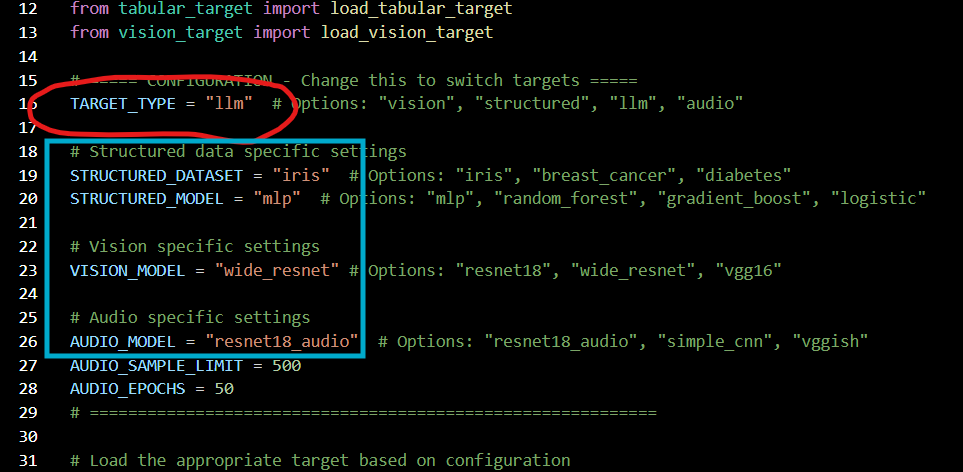

# Features

-   **Multi-modal support**: Vision (ResNet, ViT), Audio (VGGish,
    ResNet18-Audio), Tabular (MLP, Random Forest), LLMs

-   **Iterative learning**: Planner agent adapts attack strategies based
    on historical performance

-   **Stealth optimization**: Balances misclassification rate with
    perturbation metrics (L-inf, L2, MAE, SNR)

-   **Chain-of-thought reasoning**: Human-readable logs explaining each
    strategic decision

# Repository Structure

    ├── test.py                    # Main entry point
    ├── llm_models.py              # LLM agent definitions
    ├── Attacker_Toolkit.py        # Attack implementations via ART library
    ├── vision_target.py           # Load vision models
    ├── audio_target.py            # Load audio models
    ├── tabular_target.py          # Load tabular models
    ├── llm_target.py              # LLM target wrapper
    └── preprocess_imagenet_validation_data.py  # ImageNet preprocessing

# Requirements

-   Python 3.11.14

-   PyTorch 2.0+

-   Ollama (for local LLMs)

-   ART (Adversarial Robustness Toolbox)

-   LangGraph

Install dependencies:

    pip install torch torchvision langgraph langchain langchain-ollama art numpy scikit-learn

Pull required LLMs:

    ollama pull llama3.1      # Planner agent
    ollama pull qwen3.5:2b    # Evaluator agent
    ollama pull qwen3.5:0.8b  # Target LLM

# Usage

## Configure Target Type

In `test.py`:

    TARGET_TYPE = "vision"  # Options: "vision", "audio", "structured", "llm"

## For Vision

Set model name:

    VISION_MODEL = "wide_resnet"  # or resnet50, vit, resnet50_at, etc.

## For Audio

Set model and dataset limit:

    AUDIO_MODEL = "resnet18_audio"  # or simple_cnn, vggish
    AUDIO_SAMPLE_LIMIT = 500

## For Tabular

Set dataset and model:

    STRUCTURED_DATASET = "iris"     # or breast_cancer, diabetes
    STRUCTURED_MODEL = "mlp"        # or random_forest, gradient_boost, logistic

## Run the Framework

    python test.py

# How It Works

    PLANNER → ATTACKER → TARGET → EVALUATOR → (loop back to PLANNER)

-   **Planner** (Llama 3.1 8B): Selects attack type and epsilon based on
    history

-   **Attacker**: Executes attack using ART library

-   **Target**: Victim model being attacked

-   **Evaluator** (Qwen 3.5 2B): Computes misclassification rate and
    perturbation metrics

The loop runs for up to 10 iterations or until a successful attack is
found.

# Attack Types by Modality

  **Modality**   **Available Attacks**
  -------------- -----------------------------------------------------------------
  Vision         FGSM, PGD, DeepFool, Carlini L2, Adversarial Patch
  Audio          FGSM, PGD, DeepFool, Carlini L2
  Tabular        FGSM, PGD, ZOO, Boundary Attack, Decision Tree
  LLM            Jailbreak, Obfuscation (ROT13), Role Play, Context Manipulation

# Output

After completion, the framework prints:

-   Summary table of all iterations

-   Perturbation metrics (L-inf, L2, MAE, SNR, features changed)

-   Best attack ranking

-   Final verdict

Example output:

    FINAL SUMMARY TABLE - Target: audio
    Iter  Attack      Epsilon  Misclass%  MAE    SNR
    1     deepfool    0.1      100%       0.0539 18.2dB
    5     pgd         0.1      100%       0.1388 16.3dB

# Citation

If you use this framework in your research, please cite:

    J. Antony and M. Maria, "Using Agentic AI (LLMs) to Generate Adversarial Attacks 
    on Other ML Models," ECE 653 Final Report, George Mason University, 2025.

# Acknowledgments

-   [Adversarial Robustness Toolkit
    (ART)](https://github.com/Trusted-AI/adversarial-robustness-toolbox)

-   [LangGraph](https://www.langchain.com/langgraph)

-   [Ollama](https://ollama.ai)

# License

This project is for academic research purposes only.